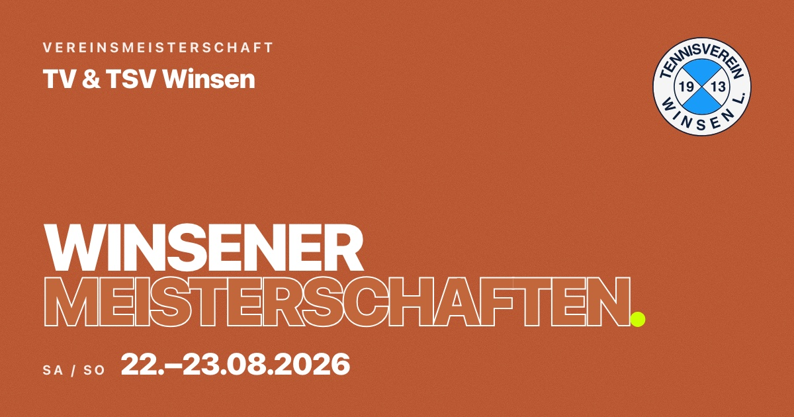

# Winsener Meisterschaften 2026



> Website zur **Stadtmeisterschaft von TV Winsen/Luhe und TSV Winsen** am **22./23. August 2026** —
> mit Online-Anmeldung und öffentlicher, live wachsender Teilnehmerliste.

[](https://github.com/tv-winsen-luhe/meisterschaften/actions/workflows/ci.yml)
&nbsp;**Live:** <https://meisterschaften.tennisverein-winsen.de/>

---

- [Quickstart](#quickstart)
- [Überblick](#überblick)
- [Befehle](#befehle)
- [Deploy & CI](#deploy--ci)
- [Admin-Zugang](#admin-zugang)
- [Releases](#releases)
- [Lizenz](#lizenz)

## Quickstart

```bash
pnpm install
pnpm cf-dev        # Build + wrangler dev (Seite + API + lokale D1) → http://localhost:8787
```

Beim ersten `wrangler dev` einmalig die lokale D1 migrieren:

```bash
wrangler d1 migrations apply winsener-meisterschaften --local
```

Reine Frontend-Arbeit ohne API geht schneller mit `pnpm dev` (Astro-Dev-Server → http://localhost:4321).

## Überblick

**Ein Cloudflare Worker** liefert die statische Astro-Seite (Workers Assets) **und** die API aus —
same-origin, kein CORS. Alle Turnierdaten liegen in **Cloudflare D1**; die App ist die alleinige
[Source of Truth](docs/adr/0001-site-owns-tournament-data.md), kein externes Turniertool.

```
meisterschaften.tennisverein-winsen.de  →  ein Worker
  ├─ statische Astro-Seite (dist/ als Assets)
  ├─ GET  /api/participants   öffentliche, bestätigte Liste (Name, Verein, Konkurrenz, LK)
  ├─ GET  /api/phase          aktuelle Phase (signup · draw · live · post-event)
  ├─ POST /api/register       Anmeldung speichern (status='new')
  ├─ POST /api/cancel         Selbst-Abmeldung (E-Mail + Nachname → status='cancelled')
  ├─ GET  /admin              Access-geschützte React-Admin (client:only)
  ├─ /api/admin/*             Admin-API: list · confirm · cancel · delete · refresh-lk · phase
  └─ D1   Tabelle „registrations" + Phase-State
```

- **Phasen** — das Event durchläuft vier operator-gesteuerte Phasen (`signup` → `draw` → `live` →
  `post-event`); jede öffentliche Fläche richtet sich danach. ([ADR-0006](docs/adr/0006-operator-controlled-phase-state.md))
- **Konkurrenzen** — Herren, Herren Challenger (nach oben geschützt, ab LK 20) und Damen. „Damen
  Freizeit" ist geplant, aber noch nicht anmeldbar.
- **Confirm-Gate** — Anmeldungen erscheinen erst nach Bestätigung durch die Turnierleitung öffentlich.
- **Abmeldung** — Mitglieder ziehen ihre Anmeldung selbst über `/abmelden` zurück (Abgleich aus
  E-Mail + Nachname); sie fällt sofort aus der öffentlichen Liste.
- **LK** — wöchentlich aus nuLiga synchronisiert (Cron, nur in `signup`) und bei der Anmeldung gegen
  den Kader gematcht; dient ausschließlich der Setzung, Default `25.0`. ([ADR-0010](docs/adr/0010-seeding-lk-module.md))
- **Kill-Switch** `PUBLIC_LIST_ENABLED` (in `wrangler.toml`) schaltet die öffentliche Liste an/aus.

Durchgehend typsicher: **Drizzle** (D1-Schema + Migrations) → Store-Modul → **Zod**-Contract in
`shared/` → **Hono** + `@hono/zod-validator` im Worker → typsicherer **Hono `hc`**-Client
([ADR-0009](docs/adr/0009-end-to-end-type-safety-drizzle-zod-hono.md)). Stack: Astro 7 (zero client JS
by default), Tailwind CSS 4, TypeScript (strict), pnpm, Node 24.

## Befehle

| Befehl           | Wirkung                                                     |
| ---------------- | ----------------------------------------------------------- |
| `pnpm dev`       | Astro-Dev-Server (ohne API) → http://localhost:4321         |
| `pnpm cf-dev`    | Build + `wrangler dev` (Seite + API + lokale D1) → :8787    |
| `pnpm build`     | `astro check` + Build                                       |
| `pnpm lint`      | ESLint                                                      |
| `pnpm test`      | Vitest                                                      |
| `pnpm format`    | Prettier (write)                                            |
| `pnpm cf-deploy` | Build + D1-Migrationen + `wrangler deploy` (Notfall-Deploy) |

## Deploy & CI

Deployt wird **nicht** bei Push auf `main`, sondern erst beim **Veröffentlichen eines GitHub-Releases**
(`release: published`) — das Publish ist der bewusste Go-Live.
([ADR-0015](docs/adr/0015-deploy-on-release-publish.md))

- `.github/workflows/ci.yml` läuft bei jedem PR und Push auf `main`: der `checks`-Job fährt
  `format:check → lint → build → test`. Bei einem (Nicht-Pre-)Release hängt daran der `deploy`-Job
  (`needs: checks`, auf dem getaggten Commit) — D1-Migrationen + `wrangler deploy`. Ein kaputter Stand
  wird nie deployt.
- `main` ist branch-protected: PR-Pflicht, erforderliche Checks, Conventional-Commit-Check auf den
  **PR-Titel** (= Squash-Commit-Subject). ([ADR-0013](docs/adr/0013-public-repo-for-branch-protection.md))

**Einmalige Einrichtung** (Account „TV Winsen / Luhe"):

```bash
wrangler login
export CLOUDFLARE_ACCOUNT_ID=<account-id>                          # liegt nicht in wrangler.toml
wrangler d1 create winsener-meisterschaften                        # database_id → wrangler.toml
wrangler d1 migrations apply winsener-meisterschaften --remote
pnpm cf-deploy
```

Danach die Custom Domain im Cloudflare-Dashboard auf den Worker legen. Für CI im Repo hinterlegen:
`CLOUDFLARE_API_TOKEN` (Secret, „Edit Cloudflare Workers" + D1: Edit) via `gh secret set …` und
`CLOUDFLARE_ACCOUNT_ID` (Repo-_Variable_) via `gh variable set …`. In `wrangler.toml` steht nur die
`database_id`; die `account_id` zieht Wrangler aus `CLOUDFLARE_ACCOUNT_ID`. Die Worker-Secrets
(`TELEGRAM_BOT_TOKEN`, `TELEGRAM_CHAT_ID`) bleiben über Deploys hinweg erhalten.

## Admin-Zugang

Die Operator-Flächen (`/admin`, `/api/admin/*`) sind in Produktion **am Edge durch Cloudflare Zero
Trust Access** abgesichert (Login per E-Mail-OTP über `tv-winsen.cloudflareaccess.com`); der Worker
hat **keine** eigene Auth. Unauthentifizierte Requests erreichen ihn gar nicht erst. Die öffentliche
API und der Cron bleiben außerhalb von Access. Lokal (`wrangler dev`) greift Access nicht — die Admin
ist auf `localhost` offen. ([ADR-0008](docs/adr/0008-keep-astro-cloudflare-polling-access.md))

Zugang verwalten: Cloudflare-Dashboard → **Zero Trust → Access → Applications → „Winsener
Meisterschaften – Admin"**.

> **Zwei load-bearing Regeln** halten die Edge-only-Auth sicher: `workers_dev = false` (kein
> ungeschützter zweiter Hostname) und **jede Operator-Route muss unter `/api/admin/*` liegen** — eine
> Route außerhalb wäre von Geburt an öffentlich.

## Releases

`.github/workflows/release.yml` lässt [SAVR](https://github.com/21stdigital/savr-action) bei jedem Push
auf `main` einen **einzelnen Draft-Release** aktuell halten (nächste Version + Notes aus den
Conventional-Commit-PR-Titeln). Veröffentlicht wird **von Hand** — und dieses Publish löst den Deploy
aus. Die Version ist ein Meilenstein-Label: `fix`/`feat` treiben Patch/Minor, `v1.0.0` wird zum
turnierreifen Stand von Hand geschnitten (kein `feat!`).
([ADR-0014](docs/adr/0014-savr-draft-releases-no-standing-environments.md))

## Lizenz

© 2026 Tennisverein Winsen (Luhe) von 1913 e.V. — alle Rechte vorbehalten. Siehe [`LICENSE`](./LICENSE).
